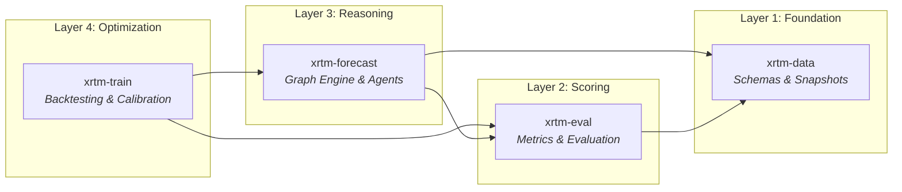

<!---
Copyright 2026 XRTM Team. All rights reserved.

Licensed under the Apache License, Version 2.0 (the "License");
you may not use this file except in compliance with the License.
You may obtain a copy of the License at

    http://www.apache.org/licenses/LICENSE-2.0

Unless required by applicable law or agreed to in writing, software
distributed under the License is distributed on an "AS IS" BASIS,
WITHOUT WARRANTIES OR CONDITIONS OF ANY KIND, either express or implied.
See the License for the specific language governing permissions and
limitations under the License.
-->

<p align="center">
    <br>
    
    
    
    <a href="https://www.xrtm.org"></a>
</p>

<h1 align="center">xrtm-forecast</h1>

<h3 align="center">
    <p>Professional engine for generative forecasting and agentic reasoning</p>
</h3>

`xrtm-forecast` acts as the rigorous backbone for state-of-the-art agentic workflows, bridging the gap between rapid prototyping and mission-critical deployment.

It centralizes the "Reasoning Graph" definition so that agent behaviors are deterministic and auditable. `forecast` is the pivot across the ecosystem: if a provider is supported, it can be plugged into any agent topology (Orchestrator, Debate, Consensus) without changing business logic.

We pledge to uphold research-grade transparency: strict typing, zero-tolerance verification, and rigorous double-trace auditability for every decision made by an AI.

## The XRTM Ecosystem

`xrtm-forecast` is one of four packages in the XRTM ecosystem, each with a specific role:



| Package | Role | PyPI |
|---------|------|------|
| **xrtm-data** | Ground-truth schemas, temporal snapshots | `pip install xrtm-data` |
| **xrtm-eval** | Brier scores, ECE, trust primitives | `pip install xrtm-eval` |
| **xrtm-forecast** | Orchestrator, agents, inference providers | `pip install xrtm-forecast` |
| **xrtm-train** | Backtesting, trace replay, calibration | `pip install xrtm-train` |

> **For most users**: `pip install xrtm-forecast` is sufficient—it automatically installs `xrtm-data` and `xrtm-eval`.
> **For researchers**: `pip install xrtm-train` installs the full stack including backtesting tools.

## Installation

### Standard Installation (Cloud + Core)
```bash
pip install xrtm-forecast
```

### Hardware-Specific Local Inference
```bash
pip install "xrtm-forecast[transformers]"  # PyTorch + HuggingFace
pip install "xrtm-forecast[vllm]"          # High-throughput serving
pip install "xrtm-forecast[llama-cpp]"     # CPU-optimized GGUF
pip install "xrtm-forecast[xlm]"           # Local Encoder specialists
```

## Quickstart

Get started with `xrtm-forecast` right away with the `Analyst` API. The `Analyst` is a high-level reasoning class that supports research, search, and probability estimation.

```python
from xrtm.forecast import AsyncRuntime, create_forecasting_analyst

async def main():
    # 1. Instantiate the analyst (API keys injected from env)
    agent = create_forecasting_analyst(model_id="gemini")
    
    # 2. Execute reasoning loop
    result = await agent.run(
        "Will a general-purpose AI (AGI) be publicly announced before 2030?"
    )
    
    # 3. Inspect the rigorous output
    print(f"Confidence: {result.confidence}")
    print(f"Reasoning: {result.reasoning}")

if __name__ == "__main__":
    # The AsyncRuntime ensures uvloop is used (if available) 
    # and provides a consistent entrypoint for the platform.
    AsyncRuntime.run_main(main())
```

## Roadmap

To understand our vision for "Institutional Grade" forecasting, including our focus on Time Travel (Chronos), Calibration, and Dynamic Trajectories (Sentinel), please read our **[Strategic Roadmap](ROADMAP.md)**.

## Key Features

*   **Institutional Sovereignty**:
    *   **Merkle Reasoning**: Every state transition is anchored via SHA-256 Merkle proofs.
    *   **.xrtm Manifests**: Portable bundles containing full reasoning traces, telemetry, and hashes.
    *   **Source Epistemics**: Trust scoring via `IntegrityGuardian` (in `xrtm-eval`).
*   **Institutional Grade Physics**:
    *   **Chronos Protocol**: Time-travel safe backtesting with instant-sleep acceleration.
    *   **Sentinel Protocol**: Forecast trajectories to track probability evolution.
    *   **Calibration**: Native `PlattScaler`, `BetaScaler`, and Brier Score decomposition.
    *   **Inverse Variance Weighting (IVW)**: Uncertainty-aware consensus for multi-agent aggregation.
*   **Advanced Reasoning**:
    *   **Recursive Consensus**: Peer-review topology that loops until confidence threshold is met.
    *   **Fact-Checking**: Dedicated `FactCheckerAgent` to verify claims against external tools.
    *   **Orchestrator**: Async graph engine with conditional edge support.
*   **Safety & Compliance**:
    *   **Async Runtime**: Managed event loop facade.
    *   **Provider Interface**: Swap out OpenAI for Anthropic, Gemini, or vLLM with zero code changes.
    *   **Sovereign Memory**: Abstracted vector storage (ChromaDB) for RAG pipelines.

## Why should I use xrtm-forecast?

1.  **Temporal Integrity (The Time Machine)**:
    *   Most agent frameworks leak future data during backtests. `xrtm-forecast` has a Temporal Sandboxing engine that rigidly enforces cut-off dates for search and memory.
    *   Verify your strategies against past events with zero look-ahead bias.

2.  **Probabilistic Rigor**:
    *   Agents are treated as calibrated instruments, not just chatbots. We support native Brier Score calculation, Reliability Diagrams, and Confidence Interval estimation out of the box.

3.  **Double-Trace Auditability**:
    *   Forecasting requires accountability. We provide a dual-layer audit trail: Structural (OTel traces of execution flow) and Logical (reasoning snapshots) for every prediction.

4.  **Dynamic Trajectories (Sentinel Protocol)**:
    *   Move beyond static snapshots. Our architecture supports continuous forecasting, allowing agents to ingest streaming news and output probability updates over time without expensive re-runs.

5. **Hybrid "Quant-Qual" Intelligence**:
    *   Seamlessly mix fast statistical models (e.g., ARIMA, XGBoost) with slow, deliberative LLM Agents in the same graph.
    *   Orchestrate complex "Consensus" topologies where multiple agents debate to reduce variance.

6. **Institutional-Grade Compliance**:
    *   Built for environments where "Black Boxes" are forbidden.
    *   Every component is strictly typed, and our **Managed Async Runtime** ensures that background tasks are traceable, high-performance (uvloop), and time-travel safe (Chronos).
    *   See our **[Architecture Overview](docs/architecture.md)** for a deep dive into Core ABCs and Agent topologies.

## Why shouldn't I use xrtm-forecast?

*   You need a generic "Chat with PDF" or "Customer Support" bot. We are hyper-focused on Forecasting and Research workflows.
*   You want "magic" autoscaling or loose typing. We prioritize correctness, repeatability, and type-safety over ease of prototyping.
*   You don't care about backtesting or time-travel debugging.

## Example Components

`xrtm-forecast` comes with a comprehensive Kit of pre-built instruments. Expand the categories below to see examples.

<details>
<summary><b>Agents (Personas)</b></summary>

*   **[Minimal Agent](examples/kit/minimal_agent/run_minimal_agent.py)**: The "Hello World" of reasoning.
*   **[Forecasting Analyst](examples/kit/pipelines/forecasting_analyst/run_forecasting_analyst.py)**: A specialized researcher for binary forecasting subjects.
*   **[Fact Checker](examples/kit/agents/fact_checker_demo/run_fact_checker_demo.py)**: An agent that verifies claims against tools.
*   **[Adversary (Red Team)](examples/kit/agents/adversary_demo/run_adversary_demo.py)**: An agent trained to find flaws in arguments.

</details>

<details>
<summary><b>Topologies (Interaction Patterns)</b></summary>

*   **[Debate](examples/kit/topologies/debate_demo/run_debate_demo.py)**: Two agents arguing for opposing sides before a judge.
*   **[Consensus](examples/kit/topologies/consensus_demo/run_consensus_demo.py)**: Multiple agents varying in temperature converging on a decision.
*   **[Orchestrator Basics](examples/core/orchestrator_basics/run_orchestrator_basics.py)**: Building a custom state machine from scratch.
*   **[Epistemic Security](examples/core/run_epistemic_security.py)**: Source trust scoring and automated filtering.
*   **[Chronos Acceleration](examples/core/run_chronos_sleep.py)**: Using virtual time to bypass real-world delays.

</details>

<details>
<summary><b>Capabilities (Skills)</b></summary>

*   **[Discovery (Search)](examples/kit/features/discovery/run_discovery.py)**: Automated information retrieval.
*   **[Streaming](examples/kit/features/streaming_demo/run_streaming_demo.py)**: Real-time token streaming for UIs.
*   **[Calibration](https://github.com/xrtm-org/train/blob/main/examples/kit/run_calibration_demo.py)**: Adjusting confidence intervals (in `xrtm-train`).
*   **[Trace Replay](https://github.com/xrtm-org/train/blob/main/examples/kit/run_trace_replay.py)**: Re-running a saved execution (in `xrtm-train`).

</details>


## Local Development

We use `uv` for dependency management and Python environment handling.

### Prerequisites
*   [uv](https://github.com/astral-sh/uv) installed (`curl -LsSf https://astral.sh/uv/install.sh | sh`)
*   Python 3.11 or higher

### Setup
We provide a setup script to bootstrap your environment and install sibling projects in editable mode:

```bash
./scripts/setup_dev.sh
```

### Common Commands

*   **Run Check (Lint/Type)**: `uv run scripts/audit/check_docs.py` (and usage of standard tools `ruff check .`, `mypy .`)
*   **Run Tests**: `uv run pytest tests/`
*   **Run Live Tests**: `uv run pytest tests/live --run-live`

### Containerized Development (Optional)
If you prefer a pre-configured environment or are waiting for local setup approval, you can still use the **Dev Container**.

1.  Open in VS Code.
2.  Run **"Dev Containers: Reopen in Container"**.
3.  The environment will auto-configure (though `setup_dev.sh` logic is mirrored in `postCreateCommand`).

