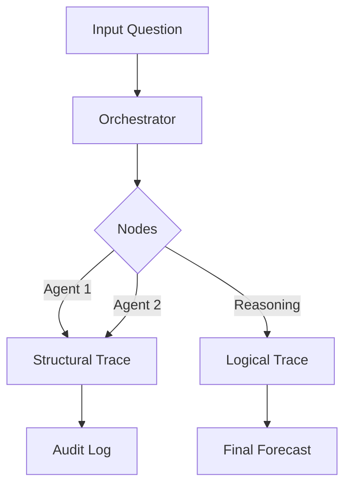
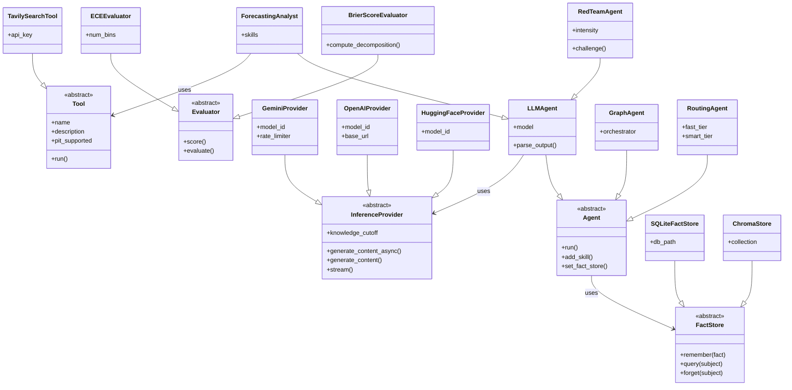

# Architecture & Design Principles

`xrtm-forecast` is built on a "Platform vs. Application" architecture. We distinguish clearly between the **Engine** (the structural bricks) and the **Experts** (the pre-assembled kits).

## Ecosystem Overview

`xrtm-forecast` is part of a four-package ecosystem with strict layer dependencies:

| Layer | Package | Role | Can Import From |
|-------|---------|------|-----------------|
| 4 | `xrtm-train` | Backtesting, calibration | forecast, eval, data |
| 3 | `xrtm-forecast` | Graph engine, agents | eval, data |
| 2 | `xrtm-eval` | Metrics, trust primitives | data |
| 1 | `xrtm-data` | Schemas, snapshots | *(none)* |

> See [.agent/rules/governance.md](../.agent/rules/governance.md) for detailed import rules.

---

## Core Philosophy: The Lego Analogy

To understand how to build with this library, imagine a Lego set:

1.  Abstractions (The Bricks): These are the fundamental shapes. A 2x4 brick doesn't know if it's part of a car or a house; it only knows how to click into other bricks.
2.  Specialists (The Kits): These are pre-designed models (like a Lego Starship). They come with instructions and a specific "mindset," but they are built entirely using the standard bricks.
3.  The Registry (The Catalog): This is where you find which bricks and kits are currently available to use.

---

## The Agent Hierarchy

We organize the `agents/` directory to reflect this split. This ensures the engine remains "lean" while the library of experts can grow infinitely.

### 1. Structural Abstractions (`src/forecast/kit/agents/*.py`)
These are the Shapes. They define mechanical behavior, not business logic.
- **`Agent`**: The base contract. Defines how an object interacts with a Graph.
- **`LLMAgent`**: The bridge to intelligence. Knows how to prompt, parse, and handle model context.
- **`ToolAgent`**: The wrapper for deterministic code. Allows standard functions to live in the graph.
- **`GraphAgent`**: The recursion brick. Allows an entire pipeline to be treated as a single agent.

### 2. Specialist Implementations (`src/forecast/kit/agents/specialists/*.py`)
These are the Roles. They are built by inheriting from the abstractions above.
- **`ForecastingAnalyst`**: A pre-built persona that uses Bayesian reasoning to solve problems.
- **`FactCheckerAgent`**: A dedicated agent for NLI-based claim verification (`src/forecast/kit/agents/fact_checker.py`).
- **`RecursiveConsensus`**: A topology for peer review and loop-back (`src/forecast/kit/topologies/consensus.py`).
- **`Generic Agent + Skills`**: We prefer equipping standard agents with skills over creating rigid subclasses.

---

## System Layers

### 1. The Orchestration Layer (`src/forecast/core/`)
The `Orchestrator` is the state machine. It doesn't "think"—it just moves the `BaseGraphState` from one node to the next based on your configuration.

### 2. The Inference Layer (`src/forecast/providers/inference/`)
Standardizes LLM communication. Whether you use Gemini, OpenAI, or a local model, the agent only sees the `InferenceProvider` interface.

### 2a. The Async Runtime (`src/forecast/core/runtime.py`)
To ensure "Institutional Grade" safety and performance, we do not use raw `asyncio`.
- **`AsyncRuntime` Facade**: Wraps `legacy` asyncio.
- **Orphan Prevention**: Enforces named tasks for telemetry.
- **Time Travel**: Prepares the system for Chronos by wrapping `sleep()` calls.
- **High Performance**: Automatically installs `uvloop` if available.

### 3. The Skill Layer (`src/forecast/kit/skills/`)
Contains the **Skill Registry**.

### Taxonomy: Skills vs. Tools
To keep the system modular, we strictly distinguish between:
*   The Tool (`src/forecast/providers/tools/`): An atomic, stateless function (e.g., `GoogleSearch.execute()`). It wraps a specific driver or API.
*   The Skill (`src/forecast/kit/skills/`): A high-level behavior that *uses* tools (e.g., `SubjectInquirySkill`). It manages retries, error handling, and prompt logic.

*Rule: Agents possess Skills. Skills control Tools.*

### 4. Protocols & Physics
- **Chronos (Time)**: `TemporalContext` acts as the single source of truth for time. The `GuardianTool` wrapper enforces this by blocking non-PiT tools during backtests.
- **Sentinel (Space)**: `ForecastTrajectory` captures the *evolution* of a probability over time, not just the final snapshot.
- **Equilibrium (Calibration)**: The `PlattScaler` ensures that subjective confidence intervals match objective frequencies, curing LLM over-confidence.

## Data Flow & Traceability

We use a Double-Trace methodology for every forecast:

- Structural Trace: "Which agents were involved in this decision?" (The Audit Trail).
- Logical Trace: "What assumptions were made by the agents?" (The Mental Model).

---

## Directory Map

- `src/forecast/core/`: The "Bus", Interfaces, and Physics (Orchestrator, Runtime, Guardian).
- `src/forecast/kit/`: The Applied Layer (Agents, Skills, Topologies).
- `src/forecast/providers/`: The Hardware Layer (Inference, Memory, Tools).

---

## Class Dependency Diagram

The following diagram shows the relationship between Core ABCs and their implementations:

### Key Architectural Rules

1. **Core never imports Kit**: ABCs in `core/` cannot depend on implementations in `kit/`.
2. **Providers are interchangeable**: Any `InferenceProvider` can be swapped without changing agent code.
3. **FactStore enables institutional memory**: Agents can optionally connect to a `FactStore` via `set_fact_store()`.

