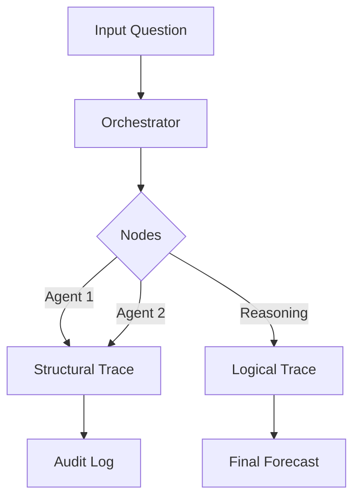

# Architecture & Design Principles

`xrtm-forecast` is built on a "Platform vs. Application" architecture. We distinguish clearly between the **Engine** (the structural bricks) and the **Experts** (the pre-assembled kits).

## Core Philosophy: The Lego Analogy

To understand how to build with this library, imagine a Lego set:

1.  **Abstractions (The Bricks)**: These are the fundamental shapes. A 2x4 brick doesn't know if it's part of a car or a house; it only knows how to click into other bricks.
2.  **Specialists (The Kits)**: These are pre-designed models (like a Lego Starship). They come with instructions and a specific "mindset," but they are built entirely using the standard bricks.
3.  **The Registry (The Catalog)**: This is where you find which bricks and kits are currently available to use.

---

## The Agent Hierarchy

We organize the `agents/` directory to reflect this split. This ensures the engine remains "lean" while the library of experts can grow infinitely.

### 1. Structural Abstractions (`src/forecast/agents/*.py`)
These are the **Shapes**. They define mechanical behavior, not business logic.
- **`Agent`**: The base contract. Defines how an object interacts with a Graph.
- **`LLMAgent`**: The bridge to intelligence. Knows how to prompt, parse, and handle model context.
- **`ToolAgent`**: The wrapper for deterministic code. Allows standard functions to live in the graph.
- **`GraphAgent`**: The recursion brick. Allows an entire pipeline to be treated as a single agent.

### 2. Specialist Implementations (`src/forecast/agents/specialists/*.py`)
These are the **Roles**. They are built by inheriting from the abstractions above.
- **`ForecastingAnalyst`**: A pre-built persona that uses Bayesian reasoning to solve problems.
- **`ResearcherAgent`** (Coming soon): Focused on web-search and data synthesis.

---

## System Layers

### 1. The Orchestration Layer (`src/forecast/graph/`)
The `Orchestrator` is the state machine. It doesn't "think"—it just moves the `BaseGraphState` from one node to the next based on your configuration.

### 2. The Inference Layer (`src/forecast/inference/`)
Standardizes LLM communication. Whether you use Gemini, OpenAI, or a local model, the agent only sees the `InferenceProvider` interface.

### 3. The Capability Layer (`src/forecast/tools/`)
Contains the **Tool Registry**. This is where external capabilities (like `strand-agents` tools) are ingested and made available to agents.

---

## Data Flow & Traceability

We use a **Double-Trace** methodology for every forecast:

- **Structural Trace**: "Which agents were involved in this decision?" (The Audit Trail).
- **Logical Trace**: "What assumptions were made by the agents?" (The Mental Model).

---

## Directory Map

- `src/forecast/agents/`: Core shapes and bricks.
- `src/forecast/agents/specialists/`: Pre-built expert personas.
- `src/forecast/graph/`: The flow engine (Orchestrator).
- `src/forecast/inference/`: Model transport and rate limiting.
- `src/forecast/tools/`: Extension points for external capabilities.
- `src/forecast/schemas/`: The shared language of the system.
