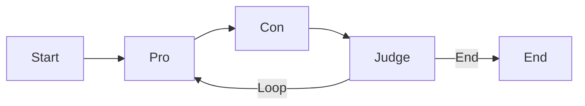
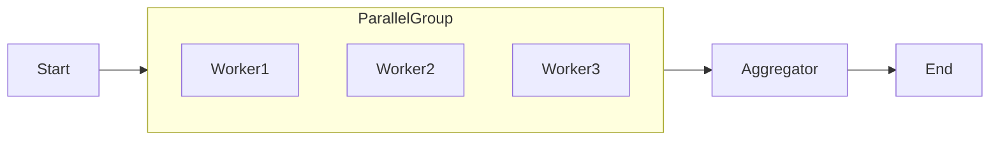

# Composable Topologies

The `forecast.kit.patterns` module provides pre-wired architectural patterns for reasoning. Instead of manually wiring every edge in an `Orchestrator`, you can use these factories to instantiate robust, institutional-grade topologies.

## Philosophy
We adhere to the "Pure Core, Practical Shell" philosophy:
*   **Pure Core**: The `Orchestrator` engine handles execution, state, and parallelism.
*   **Practical Shell**: Topologies are just factory functions that configure the core engine. They do not introduce new runtime logic.

## Supported Topologies

### 1. Debate Topology
*Factory*: `create_debate_graph()`

The Debate topology wires three agents into a structured argumentative loop. This pattern is essential for Consensus Building and Adversarial Verification.



**Usage:**
```python
from xrtm.forecast.kit.patterns import create_debate_graph

graph = create_debate_graph(
    pro_agent=pro_agent,
    con_agent=con_agent,
    judge_agent=judge_agent,
    max_rounds=3
)
result = await graph.run("Thesis: Inflation is transitory.")
```

### 2. Fan-Out Topology
*Factory*: `create_fanout_graph()`

The Fan-Out topology executes N worker Stages **in parallel** (concurrently) and then aggregates their results. This is critical for **Horizontal Scaling** (e.g., analyzing 50 stock tickers at once).



**Usage:**
```python
from xrtm.forecast.kit.patterns import create_fanout_graph

workers = [analyst_1, analyst_2, analyst_3]
graph = create_fanout_graph(
    workers=workers,
    aggregator=portfolio_manager
)
result = await graph.run("Analyze Q3 Earnings")
```
