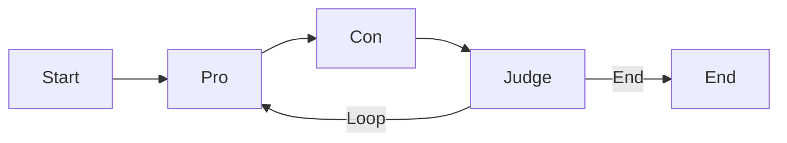
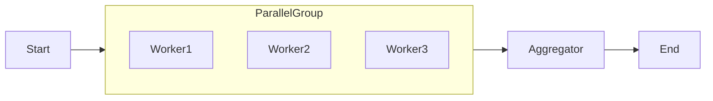

# Composable Topologies

The `forecast.kit.patterns` module provides pre-wired execution-graph patterns. Instead of wiring every edge manually in an `Orchestrator`, use these factories to assemble reusable forecast paths.

## Philosophy

- **Pure core**: the `Orchestrator` owns execution, state, and parallelism.
- **Practical shell**: topologies are factories that configure the execution graph. They do not create a second reasoning layer.

## Supported topologies

### 1. Debate topology
*Factory*: `create_debate_graph()`

The Debate topology wires three agents into a structured argumentative loop.


```mermaid
graph LR
    Start --> Pro
    Pro --> Con
    Con --> Judge
    Judge --Loop--> Pro
    Judge --End--> End
```

```python
from xrtm.forecast.kit.patterns import create_debate_graph

execution_graph = create_debate_graph(
    pro_agent=pro_agent,
    con_agent=con_agent,
    judge_agent=judge_agent,
    max_rounds=3,
)
result = await execution_graph.run("Thesis: Inflation is transitory.")
```

### 2. Fan-out topology
*Factory*: `create_fanout_graph()`

The Fan-Out topology executes N worker stages in parallel and then aggregates their results.


```mermaid
graph LR
    Start --> ParallelGroup
    subgraph ParallelGroup
        Worker1
        Worker2
        Worker3
    end
    ParallelGroup --> Aggregator
    Aggregator --> End
```

```python
from xrtm.forecast.kit.patterns import create_fanout_graph

workers = [analyst_1, analyst_2, analyst_3]
execution_graph = create_fanout_graph(
    workers=workers,
    aggregator=portfolio_manager,
)
result = await execution_graph.run("Analyze Q3 Earnings")
```
